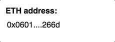

# react-eth-address

A React component to display eth addresses in a compact way and easily copy to clipboard

## Installation

```sh
npm install react-eth-address
```

## Usage

```js
import React from 'react';
import EthAddress from 'react-eth-address';

React.render(
  <EthAddress address="0x06012c8cf97bead5deae237070f9587f8e7a266d" />,
  mountNode
);
```

## Available Props

prop      | type                 | description | default value
----------|----------------------|--------------|-----------
`address`   | `string`           |              | 
`etherscan`| `bool`              |  enable link to etherscan     |`false`
`compact`| `bool`                |  enable compact mode (first 4 and last 4 characters)   |`true` 
`className`| `string`            |  Add extra css classes    |`true` 

## Custom Styles

Add extra classes using the `className` prop for custom styling

## Demo

